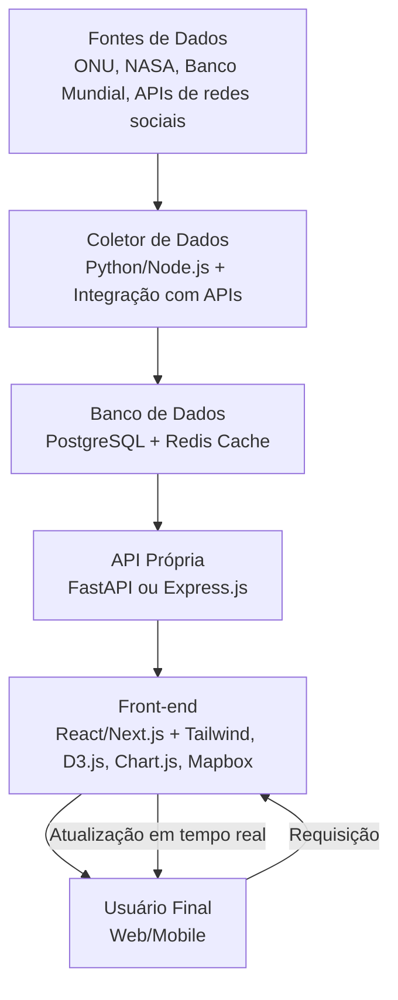

# 🌍 World Data View

**World Data View** é uma plataforma interativa que centraliza e apresenta dados quantitativos sobre o mundo e a humanidade.  
O projeto coleta informações de fontes confiáveis, processa e exibe visualmente através de gráficos, mapas e contadores em tempo real.

---

## 📌 Objetivo

Reunir dados globais de forma clara e acessível, oferecendo:

- Estatísticas em **tempo real**
- Visualizações interativas e informativas
- Ferramenta útil para **educação, pesquisa e jornalismo**

---

## 🚀 Funcionalidades

- **Contadores em tempo real**: população, nascimentos, mortes, emissões de CO₂, etc.
- **Visualizações interativas**: gráficos, mapas e infográficos.
- **Filtros personalizados** para comparar períodos e regiões.
- **API pública** para desenvolvedores integrarem dados em outros projetos.
- **Curiosidade do dia**: estatística ou fato curioso sobre o mundo.

---

## 📂 Categorias de Dados

### 📊 População & Demografia

- População mundial ao vivo
- Estimativa de quantas pessoas já viveram
- Projeções de crescimento populacional

### 🌍 Planeta & Natureza

- Taxa de desmatamento
- Temperatura média global
- Extinção de espécies

### 📱 Tecnologia & Internet

- Número de smartphones no mundo
- Fotos tiradas na história
- Volume de dados gerados na internet por dia

### 📚 Cultura & História

- Livros e filmes publicados
- Evolução e desaparecimento de línguas

### ⚠️ Impactos Sociais

- Taxas de pobreza
- Migrações globais
- Indicadores de educação

---

## 🏗 Arquitetura do Sistema

---

### 🛠 Tecnologias

**Back-end**  
- Python (FastAPI) ou Node.js (Express.js/NestJS)  
- PostgreSQL (dados persistentes)  
- Redis (cache)  

**Front-end**  
- React.js ou Next.js  
- TailwindCSS  
- D3.js / Chart.js / Mapbox  

**Infraestrutura**  
- AWS, Vercel ou DigitalOcean  
- WebSockets (Socket.IO) para atualização em tempo real  
- Cron jobs para atualização periódica  

---

### 📊 Fontes de Dados

- ONU – United Nations Population Division, UNESCO, UNHCR
- Banco Mundial – World Bank Open Data
- Agências científicas – NASA, NOAA, IUCN
- Plataformas de mídia – IMDb API, TMDb API, MusicBrainz
- Relatórios de mercado – IDC, GSMA Intelligence

---

### 👥 Público-Alvo

- Curiosos e entusiastas de estatísticas
- Estudantes e professores
- Jornalistas e criadores de conteúdo
- Empresas e ONGs

---

### 💰 Monetização (Futuro)

- Plano gratuito com dados básicos
- Plano premium com relatórios avançados e exportação
- Licenciamento de dados para empresas
- Conteúdo patrocinado

---

### 📅 Roadmap (Sugestão)

- **Fase 1 — MVP:** coletar dados de 5 fontes principais e exibir em um dashboard simples
- **Fase 2 — Beta:** implementar API pública e filtros personalizados
- **Fase 3 — Lançamento:** adicionar visualizações avançadas, dados históricos e app mobile

---

### 📜 Licença

Este projeto será licenciado sob a MIT License (a definir), permitindo uso livre com atribuição ao autor.

---

### 🤝 Contribuições

Contribuições são bem-vindas!  
Faça um fork, crie sua branch (`git checkout -b feature/nova-funcionalidade`) e envie um pull request.
